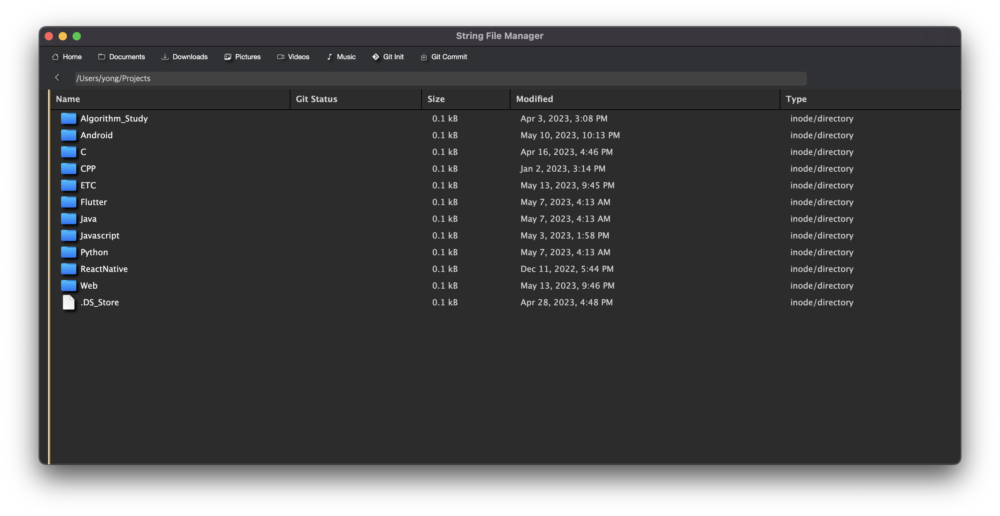
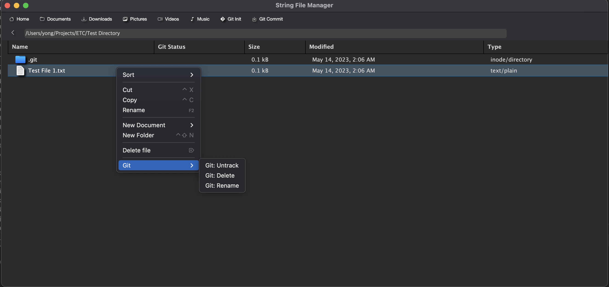
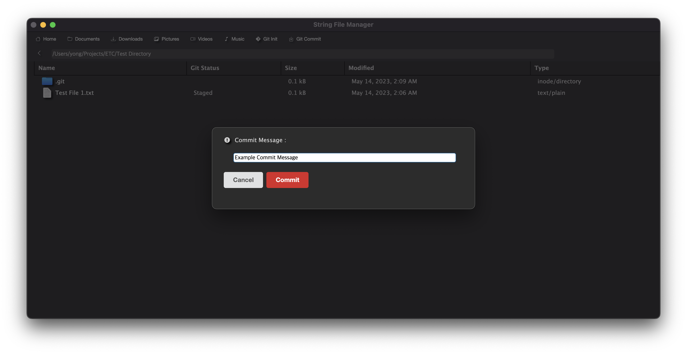
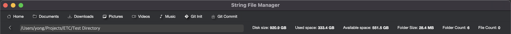
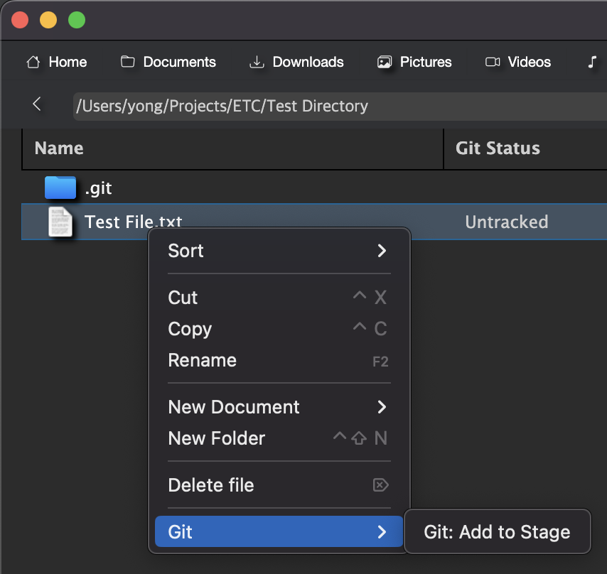

## File Manager with Git VCS

### Screenshots





### Team 15

| | 유용민 (CAU CSE 19") | 이상윤 (CAU CSE 19") | 이지윤 (CAU CSE 20") | 장세환 (CAU CSE 19") |
|-|-|-|-|-|
| Github | [yymin1022](https://github.com/yymin1022) | [falconlee236](https://github.com/falconlee236) | [jiyuneel](https://github.com/jiyuneel) | [sehwanii](https://github.com/sehwanii) |
| Role  | Project Manager <br> Git Staging 구현 <br> File Management 구현 보조 | 원본 Project 분석 <br> File Management 총괄 구현 | Git Init / Git Status 구현 <br> 예외처리 테스트 | File Management 구현 보조 <br> 예외처리 테스트 |

### Check before Run

- 본 프로젝트는 `Node.JS Electron` 라이브러리에 기반하므로, `Node.JS`의 설치가 필요합니다. [다음 링크](https://nodejs.org/ko)에서
`Node.JS 18.16.0 LTS` 버전을 다운로드해 설치한 뒤, `PATH` 환경변수에 `Node` 및 `npm` 명령을 등록합니다.
- `Unix` 환경에서의 Shell 명령을 기반으로 제작된 프로젝트입니다. `Mac OS 13 Ventura`에서 작동을 테스트하였으며,
이외의 환경(`Windows`, `Linux` 등)에서는 정상적으로 동작하지 않을 수 있습니다.
- `Git`에서 제공하는 일부 기본 설정이 이루어진 환경에서 정상적으로 동작합니다. 다음 설정값이 존재하지 않거나 올바르지 않은 경우,
프로그램이 의도와 다르게 동작할 수 있습니다.
  1. 기본 사용자 이름 및 이메일
    ```bash
    yong@macBookAir ~/$ git config --global user.name $USER_NAME
    yong@macBookAir ~/$ git config --global user.email $USER_EMAIL
    ```
  2. Git 기본 Branch 이름
    ```bash
    yong@macBookAir ~/$ git config --global init.defaultBranch master
    ```
- OS 환경에서 파일에 접근하기 위한 모든 권한이 올바르게 부여되어있어야 합니다.

### How to Compile / Run
1. 본 프로젝트를 적절한 경로에 `Clone`하고, 디렉토리 내부로 이동합니다.
```bash
yong@macBookAir ~/$ git clone https://github.com/CAU-OSS-2023-Team15/Project-1 Project1
yong@macBookAir ~/$ cd Project1 
```

2. `Node.JS` 의존성 패키지를 설치합니다.
```bash
yong@macBookAir ~/Project1$ npm install
```

3. 프로젝트를 컴파일하고 실행합니다. `package.json` 내에 `start` 명령으로 정의되어있습니다.
```bash
yong@macBookAir ~/Project1$ npm start
```

### Known Issues
- `Check before Run` 단락에서 언급된 바와 같이, `Git` 기본 설정이 올바르지 않은 경우, 프로그램이 의도와 다르게 동작할 수 있습니다.
여기서 `Git` 기본 설정이 올바르지 않은 경우란, `Shell` 환경에서 `Git` 명령을 수행했을 때, 설정에 관련된 Hint가 표시되는 경우로,
이 경우에는 프로그램이 명령의 결과문을 읽어들이는 과정에서 문제가 발생해 원하는 결과대로 작동하지 않을 수 있습니다.
- 간혹 프로그램을 컴파일하고 실행했을 때, 프로그램의 일부 버튼이 동작하지 않는 경우가 있습니다. 해결을 시도하였으나,
원본 프로젝트에서부터 이어져온 Issue이며, 별도의 Error Log도 발생하지 않아 원인을 파악하지 못했습니다.
이러한 경우, 다시 컴파일하고 실행해보면 정상적으로 작동합니다.

### How to Use



- `Git Repository`가 아닌 디렉토리에서 상단 메뉴의 `Git Init` 버튼을 클릭하면,
`.git` 디렉토리가 하위에 생성되고, `Git`을 이용해 프로젝트를 관리할 준비가 완료됩니다.



- `Git Repository` 디렉토리에서 특정 파일을 우클릭하면 `Context Menu`가 렌더링되며,
메뉴 최하단의 `Git` 하위메뉴에서 Staging 상태를 조작할 수 있습니다. 이때, 각 파일의 상태에 따라
표시되는 하위메뉴 항목은 다음 표와 같습니다.

| Git 상태 | 하위메뉴 항목 |
|---------|-----------|
| Untracked | Add to Stage |
| Staged | Unstage |
| Committed <br> Unmodified | Untrack <br> Delete <br> Rename |


- `Git Repository` 디렉토리에서 `Staged` 상태의 파일이 존재하는 경우,
상단 메뉴의 `Git Commit` 버튼을 클릭하면, `Commit Message`를 입력하기 위한
다이얼로그가 렌더링됩니다. `Commit Message`를 입력하고 버튼을 클릭하면 `Staged` 상태의
모든 파일이 `Committed` 상태로 저장됩니다.